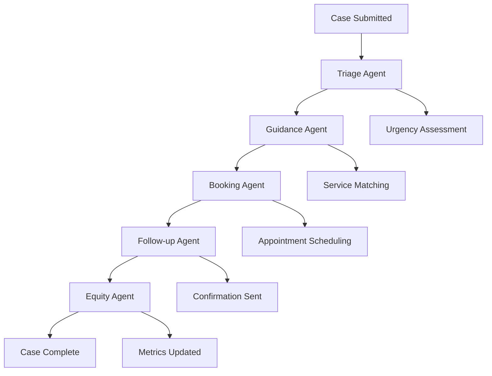

# 🤖 Frontline Worker Support AI System

> **A Multi-Agent AI System for Intelligent Citizen Service Management**

A sophisticated multi-agent AI system designed to support frontline workers and citizens by automating case triage, service matching, appointment booking, and follow-up processes. Built with FastAPI, LangGraph, and SQLAlchemy for robust, scalable citizen service management.

## 🌟 Key Features

### 🧠 **Intelligent Multi-Agent Architecture**
- **Triage Agent** 🏥: Automatically analyzes case urgency and determines service requirements
- **Guidance Agent** 🎯: Matches cases to appropriate services based on urgency and type
- **Booking Agent** 📅: Autonomously schedules appointments with optimal timing
- **Follow-up Agent** 📞: Sends plain-language confirmations and updates to citizens
- **Equity Agent** 📊: Tracks system metrics and ensures fair service distribution

### 🚀 **Advanced Capabilities**
- **Real-time Processing** ⚡: WebSocket-based live updates for case status
- **Offline Mode Support** 🔄: Degraded functionality when AI services are unavailable
- **Smart Triage** 🎯: Rule-based and AI-powered case classification
- **Autonomous Booking** 🤖: Automatic appointment scheduling with capacity management
- **Comprehensive Analytics** 📈: System metrics, utilization tracking, and performance insights

## 🏗️ System Architecture

```
┌─────────────────┐    ┌─────────────────┐    ┌─────────────────┐
│   Citizen UI    │    │  Frontline UI   │    │   Admin Panel   │
│   (Web Portal)  │    │   (Dashboard)   │    │   (Analytics)   │
└─────────┬───────┘    └─────────┬───────┘    └─────────┬───────┘
          │                      │                      │
          └──────────────────────┼──────────────────────┘
                                 │
                    ┌────────────▼──────────────┐
                    │     FastAPI Backend       │
                    │   (REST + WebSocket)      │
                    └─────────────┬─────────────┘
                                  │
                    ┌─────────────▼─────────────┐
                    │   Multi-Agent System      │
                    │   (LangGraph Workflow)    │
                    └─────────────┬─────────────┘
                                  │
                    ┌─────────────▼─────────────┐
                    │   SQLite Database         │
                    │   (SQLAlchemy ORM)        │
                    └───────────────────────────┘
```

## 🛠️ Technology Stack

- **Backend Framework**: FastAPI with async support
- **AI/ML Framework**: LangGraph for multi-agent orchestration
- **Database**: SQLite with SQLAlchemy ORM
- **Real-time Communication**: WebSocket connections
- **Frontend**: HTML/CSS/JavaScript (static files)
- **Containerization**: Docker support
- **Package Management**: UV (ultra-fast Python package manager)

## 📋 Prerequisites

- Python 3.12+
- UV package manager (recommended) or pip
- Git

## 🚀 Quick Start

### 1. **Clone the Repository**
```bash
git clone <repository-url>
cd project_ai_
```

### 2. **Install Dependencies**
```bash
# Using UV (recommended)
uv sync

# Or using pip
pip install -r requirements.txt
```

### 3. **Initialize Demo Data**
```bash
python demo_data_setup.py
```

### 4. **Start the Application**
```bash
# Development mode
uvicorn app:app --reload --host 0.0.0.0 --port 8000

# Or using Docker
docker build -t frontline-ai .
docker run -p 8000:8000 frontline-ai
```

### 5. **Access the Application**
- **API Documentation**: http://localhost:8000/docs
- **Citizen Portal**: http://localhost:8000/static/citizen.html
- **Frontline Dashboard**: http://localhost:8000/static/dashboard.html
- **Health Check**: http://localhost:8000/api/health

## 🔧 API Endpoints

### **Citizen Management**
- `POST /api/citizens/` - Create new citizen
- `GET /api/citizens/{citizen_id}` - Get citizen details

### **Case Management**
- `POST /api/cases/` - Submit new case (triggers AI processing)
- `GET /api/cases/` - List cases with filtering
- `GET /api/cases/{case_id}` - Get detailed case information
- `POST /api/cases/offline` - Submit case in offline mode

### **Service Management**
- `GET /api/services/` - List available services
- `POST /api/services/` - Create new service (admin)

### **Analytics & Monitoring**
- `GET /api/dashboard/stats` - Get dashboard statistics
- `GET /api/dashboard/metrics` - Get detailed system metrics
- `GET /api/health` - Health check endpoint

### **Real-time Updates**
- `WS /ws/{case_id}` - WebSocket for live case updates

## 🤖 Multi-Agent Workflow

The system processes cases through a sophisticated multi-agent pipeline:



### **Agent Responsibilities**

| Agent | Function | Key Features |
|-------|----------|--------------|
| 🏥 **Triage** | Case analysis and urgency assessment | Rule-based classification, duration estimation |
| 🎯 **Guidance** | Service matching and assignment | Capacity-aware matching, location optimization |
| 📅 **Booking** | Appointment scheduling | Smart slot finding, conflict resolution |
| 📞 **Follow-up** | Citizen communication | Plain-language confirmations, reminders |
| 📊 **Equity** | System monitoring | Metrics tracking, fairness oversight |

## 📊 Database Schema

### **Core Entities**
- **Citizens** 👥: Personal information and contact details
- **Cases** 📋: Service requests with status tracking
- **Services** 🏥: Available services with capacity and location
- **Appointments** 📅: Scheduled meetings with confirmation status
- **Case Updates** 📝: Audit trail of all case activities
- **System Metrics** 📈: Performance and utilization data

### **Key Relationships**
- Citizens → Cases (One-to-Many)
- Cases → Services (Many-to-One)
- Cases → Appointments (One-to-Many)
- Cases → Case Updates (One-to-Many)

## 🔄 Offline Mode

The system includes robust offline functionality:

- **Degraded Processing**: Simplified rule-based triage when AI is unavailable
- **Service Recommendations**: Basic service matching without AI
- **Manual Override**: Human intervention capabilities
- **Data Persistence**: All data saved for later processing

## 📈 Monitoring & Analytics

### **Dashboard Metrics**
- Total cases processed
- Pending vs. completed cases
- Average processing time
- Service utilization rates
- Real-time system health

### **Performance Tracking**
- Agent response times
- Case resolution rates
- Citizen satisfaction scores
- System capacity utilization

## 🐳 Docker Deployment

### **Build and Run**
```bash
# Build the image
docker build -t frontline-ai .

# Run the container
docker run -p 8000:8000 frontline-ai
```

### **Docker Compose** (if needed)
```yaml
version: '3.8'
services:
  frontline-ai:
    build: .
    ports:
      - "8000:8000"
    environment:
      - PYTHONUNBUFFERED=1
```

## 🧪 Testing the System

### **Demo Data**
The system includes comprehensive demo data:
- 8 sample citizens with realistic profiles
- 10 diverse service types (medical, emergency, social, administrative)
- 10 sample cases with varying urgency levels
- Pre-processed cases showing AI workflow
- System metrics for analytics testing

### **Test Scenarios**
1. **Critical Medical Case**: Chest pain → Emergency service → Immediate booking
2. **Administrative Request**: License renewal → DMV service → Scheduled appointment
3. **Social Services**: Housing assistance → Social services → Follow-up
4. **Emergency Response**: Domestic violence → Emergency services → Immediate response

## 🔧 Configuration

### **Environment Variables**
- `DATABASE_URL`: Database connection string (default: SQLite)
- `LOG_LEVEL`: Logging level (default: INFO)
- `OFFLINE_MODE`: Enable offline processing (default: False)

### **Service Configuration**
Services can be configured with:
- Capacity per hour
- Operating hours
- Emergency availability
- Contact information
- Location details

## 🤝 Contributing

1. Fork the repository
2. Create a feature branch (`git checkout -b feature/amazing-feature`)
3. Commit your changes (`git commit -m 'Add amazing feature'`)
4. Push to the branch (`git push origin feature/amazing-feature`)
5. Open a Pull Request

## 📝 License

This project is licensed under the MIT License - see the [LICENSE](LICENSE) file for details.

## 🆘 Support

For support and questions:
- Create an issue in the repository
- Check the API documentation at `/docs`
- Review the demo data setup for examples

## 🚀 Future Enhancements

- [ ] **Machine Learning Integration**: Advanced AI models for better triage
- [ ] **Multi-language Support**: Internationalization for diverse communities
- [ ] **Mobile App**: Native mobile applications for citizens and workers
- [ ] **Advanced Analytics**: Predictive analytics and trend analysis
- [ ] **Integration APIs**: Connect with external government systems
- [ ] **Voice Interface**: Speech-to-text for accessibility

---

**Built with ❤️ for better citizen services and frontline worker support**
